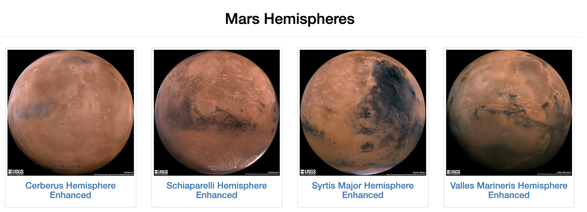

# Mission-to-Mars

In this project we gather data from multiple websites and aggregated them into our own custom website. The website we developed in this module is all about the beautiful planet MARS!!

The project demonstrate the use of website scraping techniques using python. The store the scraped data in MongoDB and then use it to build our own website using HTML & Bootstrap to make out website mobile friendly. 

We use 4 websites as data source to build our own.   
1. https://redplanetscience.com - We extract latest news about our favourite planet from here. 
2. https://spaceimages-mars.com - We extract featured images of Mars from here. 
3. https://galaxyfacts-mars.com - Our source for Mars facts.
4. https://marshemispheres.com/ - We use this as to source our full scale hemisphere images. 

Information collected from the above sites is stored in the form of json documents in MongoDB. From where we later use it to source our website. 

Our website is built using HTML, CSS & Bootstrap, we use Flask & Python to aid us in building our website. Using python helps us effeciently interface with MongoDB as well. 

Our website exposes to 2 urls.
1. index.html - This our only displayable webpage, it 
2. /scrape - This is to invokes our python code to dynamically scrape the data, store it in MongoDB and refresh the website. 

# Snapshots

1. Main website header

2. Website body to display news, facts and image. 

3. Hemisphere information

4. Mobile view

